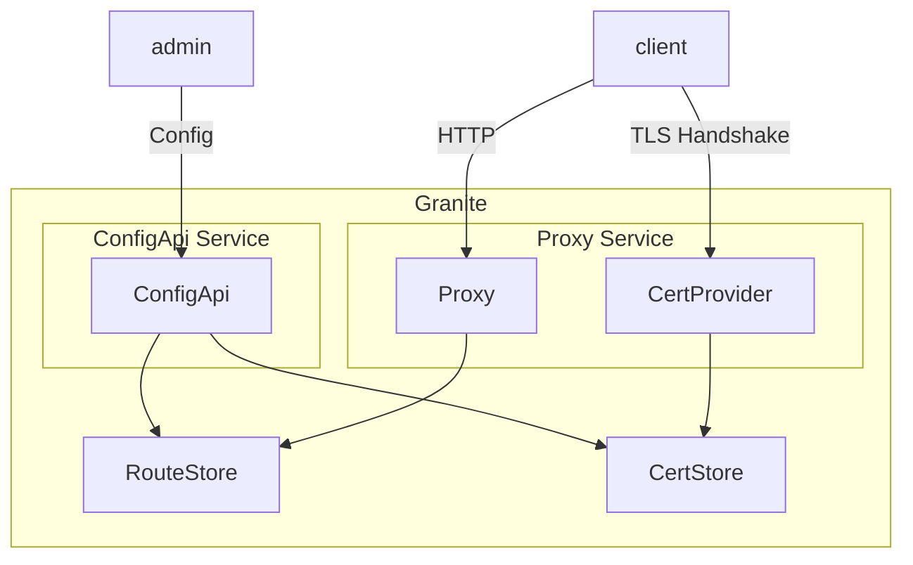

# System architecture

These are the main components of granite:

- The `ConfigApi` exposes a RESTful API for adding, replacing, and deleting routes and certificate
bindings.  It stores the configuration in a `RouteStore` and `CertStore`.

- The `CertProvider` implements Pingora's `TlsAccept` trait, which allows it to receive callbacks
during TLS handshakes.  It uses the SNI to look up the appropriate certificate in the `CertStore`.

- The `Proxy` type implements Pingora's `ProxyHttp` trait, which allows it to get callbacks during HTTP
request processing.  It looks up the appropriate route in the `RouteStore`.  Then, it uses the Route
configuration to make forwarding and caching decisions.

- The `RouteStore` maintains route information.  It provides an efficient way to to look up routes
based on properties of the incoming request (like scheme, host, and path) and an efficient way to
delete routes based on the route name.

- The `CertStore` maintains certificate bindings.  It provides an efficient way to look up certificates
based on the incoming SNI.

