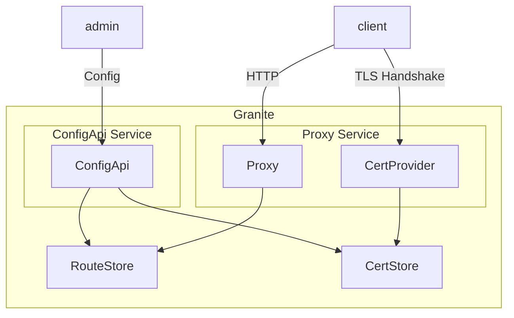

# System architecture

TODO: Describe the architecture of the project.  Include a diagram and briefly
explain each component.

```mermaid
flowchart TD
  subgraph "Granite"
    subgraph "Proxy Service"
      CertProvider
      Proxy
    end
    subgraph "ConfigApi Service"
      ConfigApi
    end
    RouteStore
    CertStore
  end
  ConfigApi --> RouteStore
  ConfigApi --> CertStore
  CertProvider --> CertStore
  Proxy --> RouteStore
  client -->|TLS Handshake| CertProvider
  client -->|HTTP| Proxy
  admin -->|Config| ConfigApi
```
